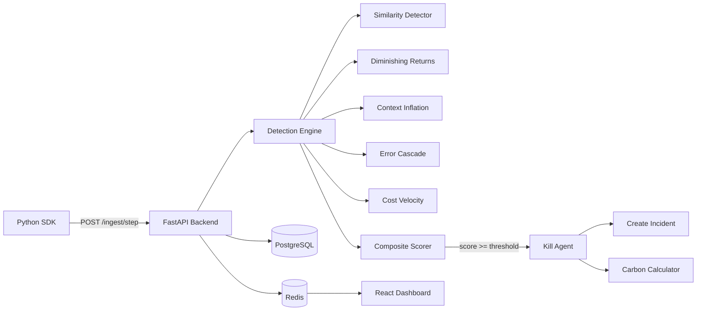

# AgentBreaker -- Real-time AI Agent Kill Switch

    

AgentBreaker is a real-time monitoring and kill-switch platform for autonomous AI agents. It detects runaway behavior -- semantic loops, diminishing returns, context bloat, error cascades, and cost spikes -- across five independent detection dimensions and terminates agents before they waste compute, budget, and carbon. Unlike simple token counters, AgentBreaker uses sentence-transformer embeddings and composite scoring to catch the patterns that actually indicate an agent has lost the plot.

## Architecture



## Quick Start

```bash
# Clone
git clone https://github.com/agentbreaker/agentbreaker.git
cd agentbreaker

# Start with Docker
docker-compose up

# Open dashboard
open http://localhost:5173
# Login: demo@techcorp.ai / demo1234

# Run a live demo
cd demo
python run_demo.py semantic_loop --api-key <your-key>
```

## Key Features

- **5-dimensional semantic detection** -- not just token counting. Embeddings-based similarity, novelty tracking, context growth analysis, error pattern recognition, and cost velocity profiling.
- **Real-time kill with impact reporting** -- every kill includes cost avoided, CO2 saved, and human-readable equivalences (trees, car km, phone charges).
- **Premium dark-mode dashboard** -- live feed, risk heatmaps, savings timeline, agent drill-down, incident forensics.
- **3-line SDK integration** -- wrap any Python agent in three lines. LangChain callback included.
- **Interactive Playground** -- run simulated failure scenarios (semantic loop, cost explosion, error cascade) and watch the detection engine respond in real time via WebSocket.

## Tech Stack

| Layer | Technology | Why |
|-------|-----------|-----|
| Backend | FastAPI + Uvicorn | Async-native, OpenAPI docs for free, sub-2ms overhead per request |
| Detection | sentence-transformers (all-MiniLM-L6-v2), scikit-learn, NumPy | Production-grade embeddings at 14K sentences/sec on CPU |
| Database | PostgreSQL 16 (prod) / SQLite + aiosqlite (dev) | JSONB for flexible thresholds, UUID PKs, async drivers |
| Cache & PubSub | Redis 7 | WebSocket fan-out for live dashboard, rate limiting |
| ORM | SQLAlchemy 2.0 (async) | Type-safe models, Alembic migrations |
| Frontend | React 18 + TypeScript + Tailwind CSS + Recharts | Component-driven, dark-mode-first, responsive |
| SDK | httpx + pydantic | Zero-dependency core client, optional LangChain integration |
| Auth | JWT (python-jose) + bcrypt + SHA-256 API keys | Dual auth: JWT for dashboard, API keys for SDK |
| Infra | Docker Compose | Single-command dev environment |

## Project Structure

```
agentbreaker/
  backend/
    app/
      api/v1/routes/     # auth, projects, api_keys, ingest, agents, incidents, analytics, settings, playground, ws
      detection/          # similarity, diminishing_returns, context_inflation, error_cascade, cost_velocity, engine, composite
      models/             # organization, user, project, api_key, agent, step, incident, metric
      services/           # ingest, auth, analytics, carbon, playground
      core/               # config, database, security, middleware, redis, exceptions
      schemas/            # pydantic request/response models
    alembic/              # database migrations
    scripts/              # seed data
  frontend/
    src/
      pages/              # overview, agents, agent-detail, incidents, incident-detail, analytics, settings, playground, login, landing
      components/         # dashboard, agents, incidents, layout, ui
      contexts/           # auth-context
  sdk/
    python/
      agentbreaker/       # client, callbacks (LangChain), types, exceptions
  demo/                   # run_demo.py, mock_tools
  docs/                   # ARCHITECTURE.md, API.md
  docker-compose.yml
```

## API Quick Reference

### Ingest a step (SDK endpoint)

```bash
curl -X POST http://localhost:8000/api/v1/ingest/step \
  -H "X-API-Key: ab_live_xxx" \
  -H "Content-Type: application/json" \
  -d '{
    "agent_id": "order-bot-session-1",
    "input": "Find the cheapest flight to Tokyo",
    "output": "Searching flights on 3 providers...",
    "tokens": 150,
    "cost": 0.004
  }'
```

### Register an organization

```bash
curl -X POST http://localhost:8000/api/v1/auth/register \
  -H "Content-Type: application/json" \
  -d '{
    "org_name": "Acme Corp",
    "email": "admin@acme.com",
    "password": "securePassword123"
  }'
```

### List agents with filters

```bash
curl http://localhost:8000/api/v1/agents?status=running&risk_min=50&sort_by=current_risk_score&sort_order=desc \
  -H "Authorization: Bearer <jwt>"
```

### Get analytics overview

```bash
curl http://localhost:8000/api/v1/analytics/overview \
  -H "Authorization: Bearer <jwt>"
```

### Run a playground simulation

```bash
curl -X POST http://localhost:8000/api/v1/playground/simulate \
  -H "Authorization: Bearer <jwt>" \
  -H "Content-Type: application/json" \
  -d '{"scenario": "semantic_loop"}'
```

## SDK Usage

### Basic

```python
from agentbreaker import AgentBreaker

with AgentBreaker(api_key="ab_live_xxx") as ab:
    result = ab.track_step(
        agent_id="my-agent",
        input="Find cheapest flight",
        output="Searching flights...",
        tokens=150,
        cost=0.004,
    )
    print(f"Risk: {result.risk_score}, Action: {result.action}")
```

### LangChain Integration

```python
from agentbreaker import AgentBreaker
from agentbreaker.callbacks import AgentBreakerCallback

ab = AgentBreaker(api_key="ab_live_xxx")
callback = AgentBreakerCallback(ab, agent_id="langchain-agent")

agent.invoke(
    {"input": "Book a flight to Tokyo"},
    config={"callbacks": [callback]},
)
```

## Documentation

- [Architecture](docs/ARCHITECTURE.md) -- system design, detection engine internals, scalability
- [API Reference](docs/API.md) -- every endpoint with examples

## License

MIT
