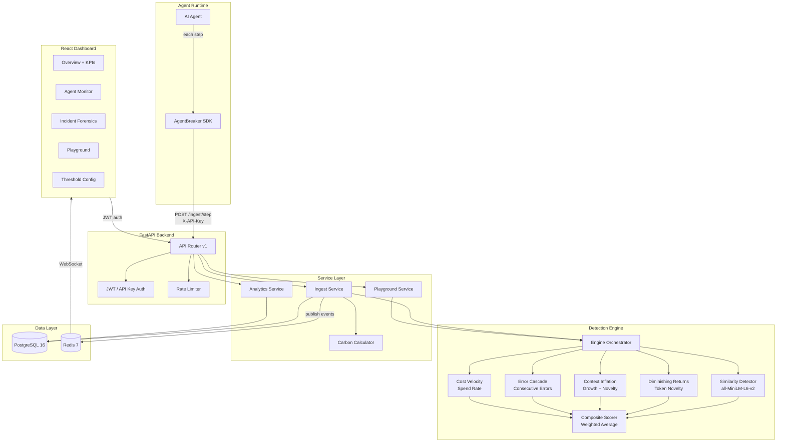

# AgentBreaker -- Architecture Document

## System Overview

### The Problem

Autonomous AI agents operating with tool access (web search, code execution, API calls) regularly enter failure modes that burn through compute budgets undetected. The most common patterns: semantic loops where the agent repeats nearly identical reasoning, context window bloat where each step appends tokens without producing new information, error cascades where the agent retries a broken tool indefinitely, and cost spikes where a sudden model upgrade or prompt explosion causes spend to accelerate beyond projections. Existing monitoring tools count tokens or set hard step limits. Neither approach catches the semantic patterns that indicate an agent has stopped making progress.

### The Solution

AgentBreaker sits between the agent orchestrator and the LLM provider. Every step the agent takes is sent to AgentBreaker's detection engine via a single API call. The engine runs five independent detectors in parallel, computes a weighted composite risk score, and returns a verdict: `ok`, `warn`, or `kill`. On kill, the SDK raises an exception that halts the agent, and AgentBreaker creates an incident record with full forensics including cost avoided, CO2 saved, and the risk score breakdown at the moment of termination.

### Market Position

AgentBreaker targets engineering teams deploying autonomous agents in production (LangChain, CrewAI, AutoGPT, custom orchestrators). The product is infrastructure-grade middleware, not an observability dashboard. The kill switch is the value proposition. The dashboard is the interface for tuning thresholds and reviewing incidents.

## Architecture Diagram



## Backend

### Technology Choice: FastAPI

FastAPI was selected for three reasons. First, it is async-native: the detection engine runs five detectors concurrently via `asyncio.gather`, and the similarity detector offloads CPU-bound embedding computation to a thread pool via `run_in_executor`. A synchronous framework would serialize these operations. Second, FastAPI auto-generates OpenAPI documentation from Pydantic schemas, which is essential for SDK developers. Third, the framework's dependency injection system provides a clean pattern for auth verification, database sessions, and Redis connections without global state.

### Application Structure

```
app/
  main.py              # App factory, middleware registration, lifespan
  core/
    config.py           # Pydantic Settings with .env support
    database.py         # AsyncSession factory, Base declarative model
    security.py         # JWT encode/decode, bcrypt, API key hashing
    middleware.py        # Request logging, Redis-backed rate limiting
    redis.py            # Redis connection pool singleton
    exceptions.py       # HTTP exception hierarchy
  api/v1/
    router.py           # Mount all sub-routers
    deps.py             # Dependency injection: get_current_user, verify_api_key_dep, get_current_org
    routes/              # One module per resource group
  detection/             # Five detectors + engine + composite scorer
  models/                # SQLAlchemy ORM models
  schemas/               # Pydantic request/response schemas
  services/              # Business logic (ingest, auth, analytics, carbon, playground)
```

### Request Lifecycle

1. Request enters via Uvicorn ASGI server.
2. `RequestLoggingMiddleware` records method, path, status, and duration.
3. `RateLimitMiddleware` increments a Redis counter keyed by API key or IP. Exceeding 100 requests/minute returns 429.
4. FastAPI router dispatches to the handler. Auth dependencies resolve first: `verify_api_key_dep` for SDK endpoints, `get_current_user` (JWT) for dashboard endpoints.
5. Handler calls the service layer. For ingest: the service persists the step, loads recent steps, runs the detection engine, calculates carbon impact, and creates an incident if action is `kill`.
6. Events are published to Redis for WebSocket fan-out to connected dashboards.
7. Response is serialized via Pydantic and returned.

## Detection Engine

The detection engine is a singleton (`DetectionEngine`) that holds five detector instances. On each step, it calls `analyze` on all five detectors concurrently and computes a weighted composite score.

### Detector 1: Similarity (weight: 0.30)

**What it detects:** Semantic loops where the agent produces nearly identical outputs across consecutive steps.

**How it works:** The last 3 outputs are encoded using `all-MiniLM-L6-v2` (384-dimensional sentence embeddings). Pairwise cosine similarity is computed via scikit-learn. The mean pairwise similarity is multiplied by 100 to produce the score. If the score exceeds the threshold (default: 85), the `semantic_loop` flag is set.

**Why this detector:** Token-level or string-level matching misses paraphrased repetitions. An agent that says "I'll search for flights now" and "Let me look up flight options" is semantically looping, but has zero character overlap. Sentence embeddings catch this.

**Thread safety:** The SentenceTransformer model is loaded once via a thread-locked singleton. Encoding runs in `asyncio.run_in_executor` to avoid blocking the event loop.

### Detector 2: Diminishing Returns (weight: 0.20)

**What it detects:** Steps that stop producing new information even when the output text changes.

**How it works:** Over a sliding window of the last 5 steps, each output is tokenized into a set of lowercase words. For each consecutive pair, the novelty ratio is computed as `|new_tokens| / |current_tokens|`. The average novelty ratio is inverted to produce the score: `(1 - avg_novelty) * 100`. If average novelty drops below the threshold (default: 0.10), the `diminishing_returns` flag is set.

**Why this detector:** An agent can produce syntactically different outputs that all contain the same information. This detector catches the information-theoretic stall even when the similarity detector does not fire.

### Detector 3: Context Inflation (weight: 0.15)

**What it detects:** Rapid growth in context window size without proportional information gain.

**How it works:** For steps that include `context_size`, the detector calculates the growth rate between consecutive steps and the output novelty (token overlap). The score combines both: `avg_growth * 100 * (1 - output_novelty)`. High growth with low novelty indicates the context is inflating with redundant content. Flags `context_bloat` when growth exceeds 20% and novelty is below 15%.

**Why this detector:** Context inflation is the silent budget killer. Each step appends to the conversation history, and LLM pricing is proportional to input tokens. An agent that appends 4K tokens per step but only generates 50 new information tokens per step is on an exponential cost curve.

### Detector 4: Error Cascade (weight: 0.20)

**What it detects:** Consecutive errors, especially when the same tool fails with the same error message.

**How it works:** Starting from the most recent step and walking backwards, the detector counts consecutive steps with non-empty `error_message`. Bonus score (+15 each) is applied if all errors involve the same tool or produce the same error message prefix. Flags `error_cascade` when consecutive errors exceed the threshold (default: 3).

**Why this detector:** Agents with tool access frequently enter retry loops when a tool is misconfigured or an API is down. Without detection, the agent will retry indefinitely, burning tokens on the prompt+error+retry cycle.

### Detector 5: Cost Velocity (weight: 0.15)

**What it detects:** Sudden acceleration in spending rate relative to the agent's baseline.

**How it works:** The detector computes cost-per-second for the last 5 steps (current velocity) and for all prior steps (baseline velocity). The ratio `current / baseline` is scaled by 20 to produce the score. Flags `cost_spike` when the ratio exceeds 3x.

**Why this detector:** Cost spikes often indicate the agent has switched to a more expensive model, started generating longer outputs, or entered a high-frequency tool-call loop. This detector catches budget anomalies that the other four miss.

### Composite Scorer

The composite score is a weighted average of all five detector scores:

| Detector | Default Weight |
|----------|---------------|
| Similarity | 0.30 |
| Diminishing Returns | 0.20 |
| Error Cascade | 0.20 |
| Context Inflation | 0.15 |
| Cost Velocity | 0.15 |

Weights are configurable per project via the Settings API. The composite score is clamped to [0, 100]. The action is determined by two thresholds:
- `score >= kill_threshold` (default: 75) -> `kill`
- `score >= warn_threshold` (default: 50) -> `warn`
- Otherwise -> `ok`

## Carbon Calculator

### Methodology

The carbon calculator converts avoided compute into environmental impact using a three-stage pipeline:

1. **Tokens to kWh:** Token counts are converted to energy consumption using empirically derived ratios per model class. A "large" model (GPT-4, Claude Opus) consumes approximately 0.002 kWh per 1,000 tokens. These ratios are derived from MLPerf inference benchmarks and published GPU power consumption data (NVIDIA A100: 300W, H100: 700W).

2. **kWh to CO2:** Energy is converted to CO2 emissions using region-specific emission factors from the International Energy Agency (IEA) 2024 data. US-East (Virginia): 0.39 kg CO2/kWh. EU-North (Sweden): 0.01 kg CO2/kWh. Each project is configured with a carbon region.

3. **CO2 to equivalences:** CO2 grams are converted to human-readable equivalences using EPA GHG Equivalencies Calculator data:
   - Trees: 1 mature tree absorbs ~22 kg CO2/year
   - Driving: EU average passenger car emits 120g CO2/km
   - Phone charges: 8.22g CO2 per full charge
   - Netflix streaming: 36g CO2 per hour

### Model Class Inference

When exact model data is unavailable, the calculator infers the model class from cost per 1,000 tokens:
- < $0.002 -> `small` (GPT-3.5, Haiku)
- < $0.01 -> `medium` (GPT-4o-mini, Sonnet)
- < $0.05 -> `large` (GPT-4, Opus)
- >= $0.05 -> `xl` (GPT-4 + tools + long context)

## Database

### Engine Selection

**Production:** PostgreSQL 16 via asyncpg. Chosen for JSONB support (detection thresholds and incident snapshots are stored as flexible JSON), robust indexing, and production-grade reliability.

**Development:** SQLite via aiosqlite. Zero-config local development. The ORM abstraction (SQLAlchemy 2.0 async) means the same models and queries work on both engines without modification.

### Schema Overview

```
organizations
  id (UUID PK)
  name, slug, plan
  created_at

users
  id (UUID PK)
  org_id (FK -> organizations)
  email (unique), hashed_password, role
  created_at

projects
  id (UUID PK)
  org_id (FK -> organizations)
  name, slug
  budget_limit, max_cost_per_agent, max_steps_per_agent
  detection_thresholds (JSONB)
  carbon_region
  created_at

api_keys
  id (UUID PK)
  project_id (FK -> projects)
  key_prefix, hashed_key (SHA-256)
  name, is_active
  created_at, last_used_at

agents
  id (UUID PK)
  project_id (FK -> projects)
  external_id, name, status
  current_risk_score, total_cost, total_tokens, total_steps
  total_co2_grams, total_kwh
  first_seen_at, last_seen_at
  UNIQUE(project_id, external_id)

steps
  id (UUID PK)
  agent_id (FK -> agents)
  step_number
  input_text, output_text
  tokens_used, cost, context_size
  tool_name, error_message, duration_ms
  created_at

incidents
  id (UUID PK)
  agent_id (FK -> agents)
  project_id (FK -> projects)
  incident_type (semantic_loop | diminishing_returns | context_bloat | error_cascade | cost_spike | composite)
  risk_score_at_kill, cost_at_kill, cost_avoided
  co2_avoided_grams, kwh_avoided, steps_at_kill
  snapshot (JSONB), kill_reason_detail
  created_at

metrics
  id (UUID PK)
  project_id (FK -> projects)
  metric_type, value
  recorded_at
```

### Key Indexes

- `agents(project_id, external_id)` UNIQUE -- fast upsert on step ingestion
- `agents(project_id, status)` -- dashboard filtering
- `agents(project_id, current_risk_score)` -- risk-sorted agent list
- `incidents(project_id, created_at)` -- chronological incident feed
- `incidents(project_id, incident_type)` -- type-filtered queries

## Frontend

### Technology Choice

React 18 with TypeScript provides type safety across the component tree. Tailwind CSS enables dark-mode-first design with utility classes rather than a CSS abstraction layer. Recharts renders the savings timeline, incident distribution, and activity heatmap.

### Design System

The dashboard uses a dark-mode-first design language optimized for operations centers and developer workflows. Key decisions:

- **Background:** Slate-900 (#0f172a) base with slate-800 cards for depth hierarchy.
- **Accent:** Emerald-500 for positive signals (savings, ok status), amber-500 for warnings, red-500 for kills and critical risk.
- **Typography:** Inter font family. Monospace (JetBrains Mono) for risk scores, costs, and technical values.
- **Layout:** Fixed sidebar with icon-first navigation. Responsive grid for KPI cards. Full-width tables for agents and incidents.

### Page Structure

| Page | Purpose |
|------|---------|
| Overview | 4 KPI cards (total savings, active agents, incidents today, avg risk), live feed, activity heatmap, savings chart |
| Agents | Filterable/sortable table with inline risk bars, status badges, cost totals |
| Agent Detail | Step-by-step timeline with risk breakdown, cost accumulation chart |
| Incidents | Filterable list with type badges, cost/CO2 avoided per incident |
| Incident Detail | Full forensic snapshot: risk breakdown at kill, step history, cost projection |
| Analytics | Savings timeline, top agents by cost, incident type distribution, carbon report |
| Settings | Detection thresholds with sliders, budget limits, notification config |
| Playground | Scenario selector, live WebSocket-driven simulation with real-time risk visualization |
| Landing | Public-facing product page with feature overview |

### Real-time Updates

The dashboard subscribes to a WebSocket at `/api/v1/ws/events`. The backend publishes step and incident events to Redis pub/sub. The WebSocket handler subscribes to the Redis channel and forwards events to connected clients. This provides sub-second latency from step ingestion to dashboard update.

## SDK

### Design Principles

The Python SDK (`agentbreaker` package) follows three principles:

1. **Minimal dependencies:** The core client uses `httpx` (HTTP) and `pydantic` (types). No framework lock-in.
2. **Fail-safe by default:** Network errors are retried 3 times with exponential backoff. If AgentBreaker is unreachable, the agent continues running (no single point of failure for your production agents).
3. **Kill by exception:** When the detection engine returns `kill`, the SDK raises `AgentKilledError`. This integrates naturally with try/except patterns in any orchestrator.

### Integration Pattern

```python
# Direct integration (any framework)
with AgentBreaker(api_key="ab_live_xxx") as ab:
    for step in agent_loop():
        result = ab.track_step(
            agent_id="my-agent",
            input=step.prompt,
            output=step.response,
            tokens=step.token_count,
            cost=step.cost,
        )
        # AgentKilledError is raised automatically on kill

# LangChain integration (zero-code change)
callback = AgentBreakerCallback(ab, agent_id="my-agent")
agent.invoke(input, config={"callbacks": [callback]})
```

### API Key Format

Keys follow the format `ab_live_` + 32 hex characters (16 random bytes). The prefix `ab_live_` identifies production keys. The key is shown once at creation and stored as a SHA-256 hash in the database. Authentication is via the `X-API-Key` header.

## Security

### Authentication

Two authentication mechanisms serve different use cases:

1. **JWT tokens** for dashboard access. Generated on login, contain `sub` (user_id) and `org` (org_id) claims. HS256 algorithm. Default expiry: 24 hours. All dashboard API endpoints verify the JWT via the `get_current_user` dependency.

2. **API keys** for SDK access. SHA-256 hashed at rest. Verified on each request by the `verify_api_key_dep` dependency, which looks up the key by prefix, then compares the full hash. Keys are scoped to a project and can be revoked.

### Password Storage

Passwords are hashed with bcrypt (per-password salt, 12 rounds by default). The `verify_password` function uses constant-time comparison via `bcrypt.checkpw`.

### Rate Limiting

Redis-backed sliding window rate limiter. 100 requests per minute per API key or IP address. Returns HTTP 429 with `Retry-After: 60` header. Health checks and WebSocket connections are exempt. When Redis is unavailable, rate limiting degrades gracefully (requests pass through).

### Multi-tenancy

All data access is scoped by organization. The `get_current_org` dependency extracts the org_id from the JWT. Every query filters by org_id or by project_ids belonging to the org. There is no global admin endpoint that crosses org boundaries.

## Why Not Celery

The detection engine runs in-process via `asyncio.create_task` rather than delegating to a Celery task queue. Three reasons:

1. **Latency:** The SDK call must return the risk score synchronously so the agent can be killed immediately. A Celery round-trip adds 50-200ms of queue overhead.
2. **Complexity:** Celery requires a message broker (RabbitMQ or Redis), a result backend, worker processes, and monitoring (Flower). AgentBreaker already uses Redis for pub/sub and rate limiting, but adding Celery's worker fleet is unnecessary at current scale.
3. **CPU profile:** The heaviest operation is the sentence-transformer encoding, which takes 5-15ms on CPU for a batch of 3 sentences. This is well within the event loop's tolerance when offloaded to a thread pool.

At higher scale, the sentence-transformer model could be served behind a dedicated inference endpoint (e.g., NVIDIA Triton or a standalone FastAPI model server), which would remove the CPU dependency from the main process entirely.

## Scalability Considerations

The current architecture is designed for a single-server deployment handling up to ~1,000 concurrent agents and ~100K steps/day. Here is what changes at scale:

### 10K Concurrent Agents

- **Database:** Add read replicas for the analytics queries. The ingest path (writes) stays on the primary. Connection pooling via pgbouncer.
- **Detection engine:** Move the SentenceTransformer model to a dedicated GPU-backed inference service. The main backend sends embedding requests via gRPC, reducing per-request latency from 15ms to 2ms.
- **WebSocket:** Move from single-server Redis pub/sub to Redis Cluster or a dedicated event streaming system (NATS, Kafka). Each backend instance subscribes to the channels for its connected clients.

### 1M Steps/Day

- **Ingest path:** Add a write-ahead buffer (Redis Streams or Kafka) between the API and the database. Steps are acknowledged immediately and persisted asynchronously. Detection still runs synchronously on the hot path.
- **Database:** Partition the `steps` table by month. Archive old steps to cold storage (S3 + Parquet). Keep only the last 7 days in hot PostgreSQL.
- **Analytics:** Pre-compute daily aggregates via a background job. The `metrics` table already exists for this purpose.
- **Horizontal scaling:** Run multiple backend instances behind a load balancer. The detection engine is stateless (all state is in the database). Redis handles pub/sub coordination.

### 100K Organizations

- **Multi-region:** Deploy backend and database in US, EU, and APAC regions. Route by organization's configured region. This also improves carbon calculation accuracy.
- **Tenant isolation:** Move from schema-per-tenant (current model with org_id filtering) to database-per-tenant for the largest customers. Smaller tenants share a pooled database.
- **API gateway:** Add an API gateway (Kong, AWS API Gateway) for rate limiting, API key validation, and request routing. Remove these responsibilities from the application code.

## Security Architecture

AgentBreaker handles sensitive production data -- agent outputs, API keys, cost metrics, and organizational configuration. The security architecture implements defense-in-depth across five layers: network, authentication, authorization, input validation, and response hardening.

### Layer 1: Transport Security

All production traffic is encrypted via TLS 1.2+. The backend enforces HTTP Strict Transport Security (HSTS) with a one-year max-age, `includeSubDomains`, and `preload` directives. This prevents protocol downgrade attacks and ensures browsers never connect over plaintext HTTP after the first visit.

### Layer 2: Authentication

Two independent authentication mechanisms serve different access patterns:

**JWT Tokens (Dashboard Access)**

- Algorithm: HS256 (HMAC-SHA256) with a server-side secret key
- Payload: `sub` (user_id), `org` (org_id), `exp` (expiration timestamp)
- Default expiry: 24 hours, configurable via `ACCESS_TOKEN_EXPIRE_MINUTES`
- Issued on successful login via `/api/v1/auth/login`
- Verified on every dashboard API call via the `get_current_user` dependency
- The secret key is loaded from environment variables, never hardcoded

**API Keys (SDK Access)**

- Format: `ab_live_` prefix + 32 hex characters (16 cryptographically random bytes)
- Storage: The full key is shown exactly once at creation. Only the SHA-256 hash is stored in the database. The key cannot be recovered from the hash.
- Verification: On each request, the `verify_api_key_dep` dependency extracts the key from the `X-API-Key` header, looks up the key by its prefix (first 8 characters), then compares the full SHA-256 hash. This two-stage lookup prevents timing attacks on the hash comparison.
- Scope: Each API key is bound to a single project. Keys can be revoked (soft-deleted) without affecting other keys on the same project.
- Audit: `last_used_at` is updated on every successful authentication, providing usage tracking for key rotation policies.

### Layer 3: Password Storage

Passwords are hashed with bcrypt using:
- Per-password random salt (generated via `bcrypt.gensalt()`)
- 12 rounds of key stretching (2^12 = 4,096 iterations)
- Constant-time comparison via `bcrypt.checkpw()` to prevent timing side-channel attacks

bcrypt's adaptive cost factor means that if compute performance doubles, the round count can be increased without changing the password verification interface.

### Layer 4: Rate Limiting

A Redis-backed sliding window rate limiter protects against brute-force attacks and denial-of-service:

- **Limit**: 100 requests per 60-second window per API key or IP address
- **Key construction**: `ratelimit:{api_key}` if an API key is present, otherwise `ratelimit:{client_ip}`
- **Counter mechanism**: Redis `INCR` with 60-second `EXPIRE`. First request in the window sets the counter to 1 and starts the TTL.
- **Response**: HTTP 429 (Too Many Requests) with `Retry-After: 60` header
- **Exemptions**: `/health`, `/docs`, `/openapi.json`, and WebSocket paths (`/api/v1/ws/*`) are exempt from rate limiting
- **Graceful degradation**: If Redis is unavailable, requests pass through without rate limiting. This ensures the core detection service remains available even during a Redis outage. The rate limiter catches and silences all Redis connection errors except its own `RateLimitError`.

### Layer 5: Input Validation and Sanitization

All user-supplied input passes through a validation layer before reaching the service or database:

**Text Sanitization (`sanitize_text`)**
- Truncation to configurable maximum length (50KB for input fields, 100KB for output fields)
- Control character stripping via regex: removes all characters in `[\x00-\x08\x0b\x0c\x0e-\x1f\x7f]` while preserving tabs, newlines, and carriage returns
- Returns empty string for null or empty input

**Agent ID Validation (`validate_agent_id`)**
- Maximum length: 255 characters
- Allowed characters: `[a-zA-Z0-9._-]`, must start with alphanumeric
- Regex-based validation prevents injection via agent IDs (which appear in database queries and dashboard displays)

**API Key Name Sanitization (`sanitize_api_key_name`)**
- HTML entity escaping via `html.escape()` prevents stored XSS through API key display names
- Truncation to 100 characters

**Token Count Validation (`validate_step_tokens`)**
- Rejects negative values
- Rejects counts exceeding 100,000 tokens per step (prevents analytics skewing from malformed SDK data)

### Layer 6: Security Response Headers

Every HTTP response includes OWASP-recommended security headers via the `SecurityHeadersMiddleware`:

| Header | Value | Purpose |
|--------|-------|---------|
| `X-Content-Type-Options` | `nosniff` | Prevents MIME-type sniffing attacks |
| `X-Frame-Options` | `DENY` | Prevents clickjacking via iframe embedding |
| `X-XSS-Protection` | `1; mode=block` | Activates legacy browser XSS filters |
| `Referrer-Policy` | `strict-origin-when-cross-origin` | Controls referrer information leakage |
| `Permissions-Policy` | Denies camera, microphone, geolocation, payment, USB, magnetometer, gyroscope | Restricts unnecessary browser feature access |
| `Cache-Control` | `no-store, no-cache, must-revalidate` | Prevents caching of sensitive API responses |
| `Pragma` | `no-cache` | HTTP/1.0 cache prevention |
| `Strict-Transport-Security` | `max-age=31536000; includeSubDomains; preload` | Enforces HTTPS for 1 year |
| `Content-Security-Policy` | `default-src 'none'; frame-ancestors 'none'` | API-only CSP baseline |
| `Server` | (removed) | Prevents server software fingerprinting |

### Layer 7: Multi-Tenant Data Isolation

All data access is scoped by organization at the dependency injection layer:

1. The `get_current_user` dependency extracts `org_id` from the JWT payload
2. The `get_current_org` dependency loads the organization record and makes it available to all downstream handlers
3. Every database query filters by `org_id` (for organization-level resources) or by `project_id` where the project belongs to the authenticated organization
4. No global admin endpoint exists that crosses organization boundaries
5. API keys are scoped to projects, which are scoped to organizations, creating a three-level access hierarchy: organization > project > API key

This architecture ensures that a compromised API key can only access data within its assigned project, not the broader organization or other tenants.

### Security Audit Checklist

| Category | Status |
|----------|--------|
| Secrets in environment variables, not code | Implemented |
| Password hashing with bcrypt + salt | Implemented |
| API keys stored as SHA-256 hashes | Implemented |
| JWT with expiration and claims validation | Implemented |
| Rate limiting with graceful degradation | Implemented |
| Input sanitization on all user-supplied fields | Implemented |
| OWASP security headers on all responses | Implemented |
| Multi-tenant data isolation at dependency layer | Implemented |
| CORS with configurable allowed origins | Implemented |
| Structured logging without sensitive data exposure | Implemented |
| HSTS with preload | Implemented |
| Server header removal | Implemented |

## Scalability Roadmap

The following roadmap outlines the engineering investments required to scale AgentBreaker from its current single-server architecture to a globally distributed platform serving enterprise customers.

### Phase 1: Production Hardening (Current -> 500 Customers)

**Timeline**: 0-6 months
**Target load**: 1,000 concurrent agents, 100K steps/day

The current architecture supports this load without structural changes. Investments focus on operational maturity:

- **Container orchestration**: Deploy backend, PostgreSQL, and Redis via Docker Compose for single-node deployments. Publish Helm charts for Kubernetes deployments.
- **CI/CD pipeline**: Automated test execution, container builds, and deployment to staging/production environments on every merge to main.
- **Monitoring**: Prometheus metrics endpoint exposing request latency percentiles, detection engine timing, database connection pool utilization, and Redis memory usage. Grafana dashboards for operational visibility.
- **Alerting**: PagerDuty integration for critical alerts: detection engine latency exceeding 500ms, database connection pool exhaustion, Redis eviction events, and HTTP 5xx error rate spikes.
- **Backup**: Automated PostgreSQL backups (pg_dump) with 30-day retention. Point-in-time recovery via WAL archiving for production deployments.

### Phase 2: Horizontal Scaling (500 -> 5,000 Customers)

**Timeline**: 6-18 months
**Target load**: 10,000 concurrent agents, 1M steps/day

This phase requires decoupling components that currently share a single process:

- **Embedding inference service**: Extract the SentenceTransformer model into a dedicated FastAPI service (or NVIDIA Triton Inference Server) running on GPU-equipped instances. The main backend sends embedding requests via gRPC with batching. This reduces per-request embedding latency from 15ms (CPU) to 2ms (GPU) and removes the primary CPU bottleneck from the API server.
- **Database scaling**: Add read replicas for analytics and dashboard queries. The ingest path (writes) stays on the primary. Connection pooling via PgBouncer with 200 connections per pool.
- **Write-ahead buffer**: Insert a Redis Streams or Apache Kafka buffer between the API and the database for step persistence. Steps are acknowledged to the SDK immediately after detection completes. Database writes happen asynchronously, decoupling SDK latency from database performance. Detection still runs synchronously on the hot path.
- **WebSocket distribution**: Move from single-server Redis pub/sub to Redis Cluster. Each backend instance subscribes to Redis channels for its connected dashboard clients. A load balancer with sticky sessions routes WebSocket connections.
- **Horizontal backend**: Run 3-5 backend instances behind an nginx or AWS ALB load balancer. The detection engine is stateless (all state is in the database and Redis). No session affinity is required for API calls.

### Phase 3: Enterprise and Multi-Region (5,000 -> 50,000 Customers)

**Timeline**: 18-36 months
**Target load**: 100,000 concurrent agents, 10M steps/day

This phase adds enterprise features and global distribution:

- **Multi-region deployment**: Deploy independent stacks in US (Virginia), EU (Frankfurt), and APAC (Tokyo). Route organizations to the nearest region based on their configured cloud region. This reduces SDK latency for global customers and satisfies data residency requirements (GDPR, PDPA).
- **Table partitioning**: Partition the `steps` table by month using PostgreSQL declarative partitioning. Archive partitions older than 90 days to cold storage (S3 + Apache Parquet). Keep only the active month and previous month in hot PostgreSQL. This maintains query performance as step volume grows.
- **Pre-computed analytics**: A background job (Celery or Temporal) computes daily, weekly, and monthly aggregates for the metrics table. The analytics API reads from pre-computed aggregates rather than scanning the steps table. This reduces dashboard query latency from seconds to milliseconds.
- **Tenant isolation tiers**: Small tenants share a pooled PostgreSQL database with org_id filtering (current model). Medium tenants get schema-per-tenant isolation. Large enterprise tenants get dedicated database instances with dedicated connection pools. Routing is handled at the API gateway layer.
- **API gateway**: Deploy Kong or AWS API Gateway in front of the backend fleet. Move rate limiting, API key validation, and request routing to the gateway layer. This reduces per-request overhead on the backend and provides centralized traffic management, geographic routing, and DDoS protection.
- **Custom detection models**: Allow enterprise customers to upload fine-tuned embedding models for domain-specific similarity detection. The embedding inference service loads custom models per-organization and routes encoding requests accordingly. This is a premium feature for customers in regulated industries (finance, healthcare) where domain-specific language makes general-purpose embeddings less effective.
- **SOC 2 Type II compliance**: Implement audit logging for all data access, role-based access control (RBAC) with principle of least privilege, encryption at rest for PostgreSQL and Redis, and formal incident response procedures. Complete SOC 2 Type II audit with a third-party auditor.

### Phase 4: Platform (50,000+ Customers)

**Timeline**: 36+ months
**Target load**: 1M+ concurrent agents, 100M+ steps/day

At this scale, AgentBreaker transitions from a product to a platform:

- **Detection marketplace**: Third-party developers publish custom detectors via a plugin SDK. Detectors are packaged as WASM modules or containerized services that conform to the `BaseDetector` interface. The engine loads them at runtime alongside the core 8 detectors. This extends the detection surface without requiring AgentBreaker engineering effort for every industry-specific failure mode.
- **Federated learning**: Aggregate anonymized detection patterns across customers to improve detection weights and baselines without exposing individual customer data. The optimal weight vector for the composite scorer evolves as the training dataset grows across the customer base.
- **Real-time model adaptation**: Replace the static weight vector with a per-customer model that adjusts weights based on the organization's historical false positive and false negative rates. This auto-tuning mechanism reduces the threshold configuration burden for customers and improves detection accuracy over time.
- **Event streaming**: Replace Redis pub/sub with Apache Kafka for event distribution. This enables durable event storage, replay for forensic analysis, and integration with customer data pipelines (Snowflake, Databricks, BigQuery) for advanced analytics beyond what the AgentBreaker dashboard provides.
